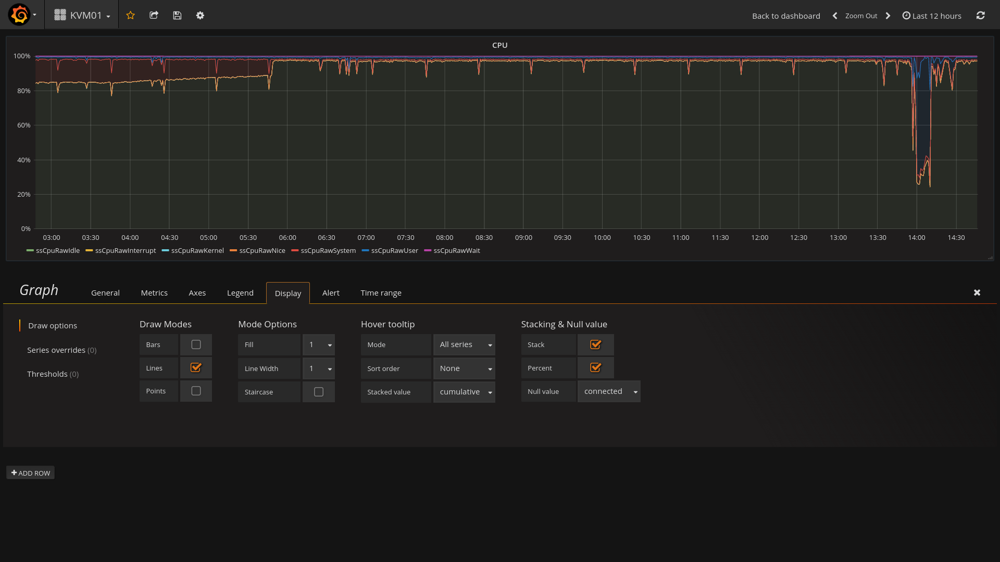
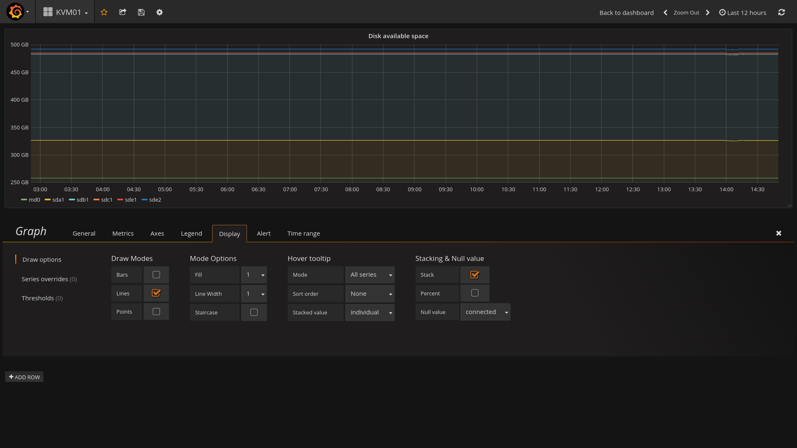
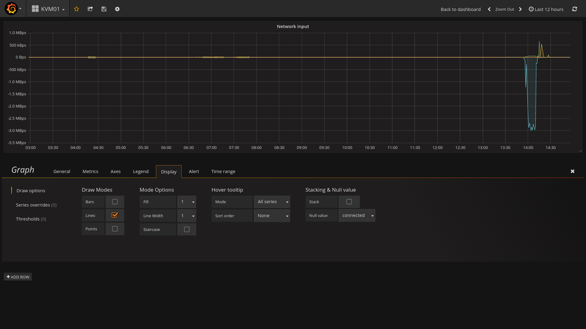
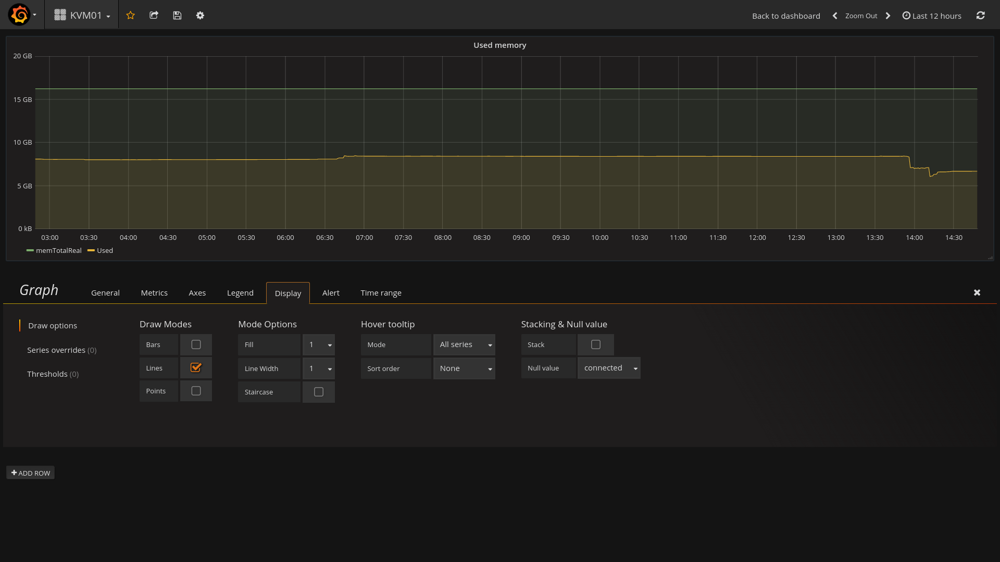

# Homelab

## HP Microserver monitoring script

The [hp_gen8_monitor.py](HP_Gen8/hp_gen8_monitor.py) script will monitor temperatures reported 
by the ILO subsystem and basic system information:
- disk space information
- system memory 
- CPU usage
- network traffic

Disks and network interface are automatically detected. System information is retrieved through SNMP. 
ILO temperatures and fan speed can be retrieved through the `ipmitool` command line utility or SNMP. Data is sent towards a configurable Carbon server. 

### Installation

The script is tested on CentOS/Fedora and Debian, but should run on any distribution as long as the proper Python packages are installed. 

#### Configure the script variables

| Variable | Description |
|----------|-------------|
| `HOST` | The IP address/hostname of the monitored host. Can be set to `127.0.0.1` if the script is executed directly on the Microserver or the Microserver's IP address. |
| `ILOHOST` | The ILO interface IP address/hostname. |
| `SNMP_COMMUNITY` | SNMP community, usually `public`. |
| `SNMP_VERSION` | SNMP version, should be `2` in mostly all situations. |
| `USE_IPMI` | If set to 1, the script calls for the `ipmitool` in order to retrieve ILO temperatures. Otherwise, SNMP data is queried. |
| `SERVER_NAME` | Name of your microserver which is prefixed to metric names. |
| `SEPARATOR` | Metric separator, defaults to a `.` character. |
| `CARBON_SERVER` | Carbon server IP address/hostname. |
| `CARBON_PORT` | UDP port where the Carbon server is listening, default 2003. |
| `DEBUG` | If set to `1` the script will print metrics, values and timestamps directly in the console in both JSON and Carbon format. |

#### Install packages for CentOS

```
yum -y install net-snmp-python ipmitool net-snmp-utils net-snmp-libs
```

#### Install packages for Debian


Enable the `non-free` repository as instructed [here](https://wiki.debian.org/SourcesList).

```
apt-get install snmp python-netsnmp snmp-mibs-downloader ipmitool
```

This should be all. Run the script and the detected metrics and values should be printed in the console, similar to:

```
microserver.cpu.core.0 6 1485088794
microserver.cpu.core.1 26 1485088794
microserver.cpu.load.15 10 1485088794
microserver.cpu.load.1 8 1485088794
microserver.cpu.load.5 6 1485088794
microserver.cpu.raw.ssCpuRawIdle 822139048 1485088794
microserver.cpu.raw.ssCpuRawInterrupt 0 1485088794
microserver.cpu.raw.ssCpuRawKernel 0 1485088794
microserver.cpu.raw.ssCpuRawNice 10710283 1485088794
microserver.cpu.raw.ssCpuRawSystem 12288031 1485088794
microserver.cpu.raw.ssCpuRawUser 20835282 1485088794
microserver.cpu.raw.ssCpuRawWait 14447575 1485088794
```

### Graphing data in Grafana

#### CPU usage 

Add this metric:
```
aliasByNode(derivative(scale(microserver.cpu.raw.*, 0.1)), 3)
```

In the Display tab, check `Stack` and `Percent`. Choose `Stacked value = cumulative`. Should give you this:



#### Disk space

Add this metric:
```
aliasByNode(microserver.disk.*.avail, 2)
```

Left Y axis set to `kilobytes`, check `Stack` and `Stacked value = individual` in the Display tab. Should give you this:



#### Network traffic

To graph incoming traffic, add these metrics:
```
aliasByNode(scaleToSeconds(nonNegativeDerivative(microserver.net.eno1.in), 1), 2)
aliasByNode(scaleToSeconds(nonNegativeDerivative(microserver.net.eno2.in), 1), 2)
```

To graph outgoing traffic as inverted traffic (below the horizontal axis) on the same panel, add these two:
```
aliasByNode(scale(scaleToSeconds(nonNegativeDerivative(microserve.net.eno1.out), 1), -1), 2)
aliasByNode(scale(scaleToSeconds(nonNegativeDerivative(microserve.net.eno2.out), 1), -1), 2)
```

Set the left Y axis to bytes/sec and you should have this:



#### Memory

Set the left Y axis to `kilobytes` and add:
```
aliasByMetric(microserver.mem.memTotalReal)
```

to draw a line indicating the total physical memory limit and:
```
alias(sumSeries(microserver.mem.memBuffer,microserver.mem.memCached,microserver.mem.memShared),'Used')
```
to graph the memory used by the system.



#### Environment

Fan speed can be graphed with:
```
alias(microserver.env.ilo.fan, 'Fan')
```

Temperatures can be graphed with:
```
aliasByMetric(microserver.env.ilo.*)
```

